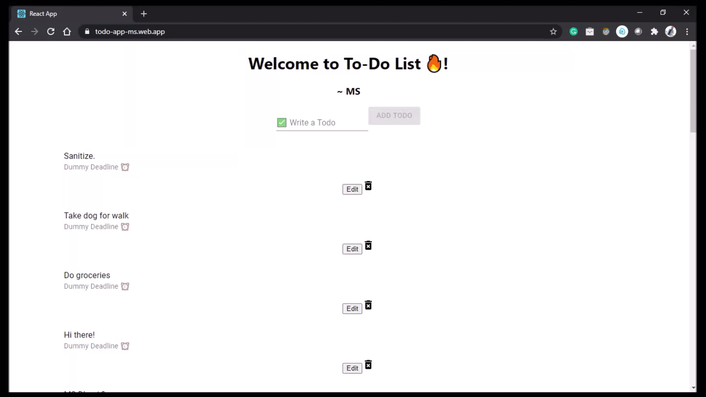
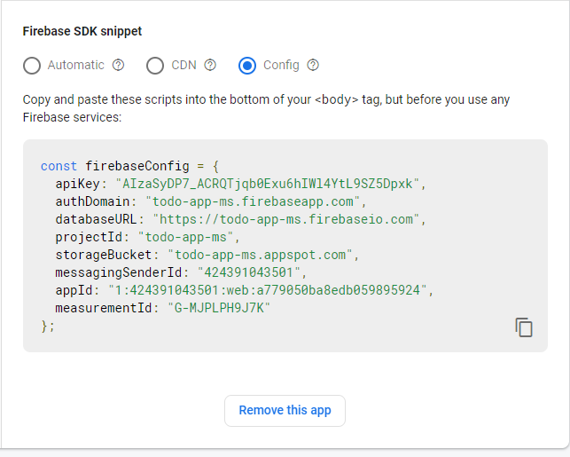
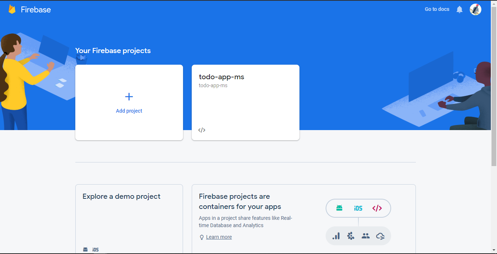
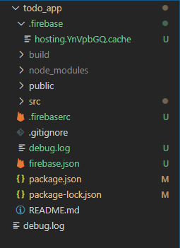

# TODO list built with Firebase + React

## Table of Content
  * [Demo](#demo)
  * [Overview](#overview)
  * [Installation](#installation)
  * [Implementation](#implementation)
  * [Deployment on Firebase](#deployment-on-firebase)
  * [Directory Tree](#directory-tree)
 
This repository consists of files required to build and host a ___REACT JS Web App___ on ___GOOGLE FIREBASE___ platform.

## Demo
Click on the [Link](https://todo-app-ms.web.app/)

## Overview
This is a Web app which will help you add Todo tasks online in Real-time. It runs dynamic Javascripts with JSX. The code is broken into functional components. It has real-time NoSQL database. It has full CRUD functionalities ( Create, Read, Update, Delete), Material UI was used for the design (front-end). Implemented two fundamentals of REACT JS : States and Props along with React Hooks.The todos get updated real time to-and-back from the database without the need of refreshing the page. 
 

## Installation
The Code is written in React JS. Node JS is required for the development of the app. If you don't have Node JS installed you can find it [here](https://nodejs.org/en/download/). 

## Implementation
It is encouraged to use Visual Studio Code editor for the implementation. Execute "npx create-react-app todo_app" in the console. Copy the scr folder [Link](https://github.com/meetsinghit/todo-web-app/tree/master/src) and paste its content in the scr folder in your local environment. Only changes which will be needed to be done is in the firebase.js file. 
* Sign up into Google Firewall [Link](https://console.firebase.google.com/)
* Create new project. Complete the setup.
* Goto Database and create new Firestore Database.(Start in test mode)
* Copy the Config file key from the Firebase SDK snipplet and paste it inside the firebase.js file under the firebaseapp function.

  
## Deployment on Firebase
Login or signup in order to create virtual app. 

Our next step would be to execute the following commands :-
  * npm install -g firebase-tools
  * firebase login
  * npm install @material-ui/core
  * npm i firebase
  * firebase init
  * npm i @material-ui/icons
  * npm start
  * npm run build
  * npm deploy
* That's it. Enjoy!

## Directory Tree 

## Technologies Used

• Please do ⭐ the repository, if it helped you in anyway.
